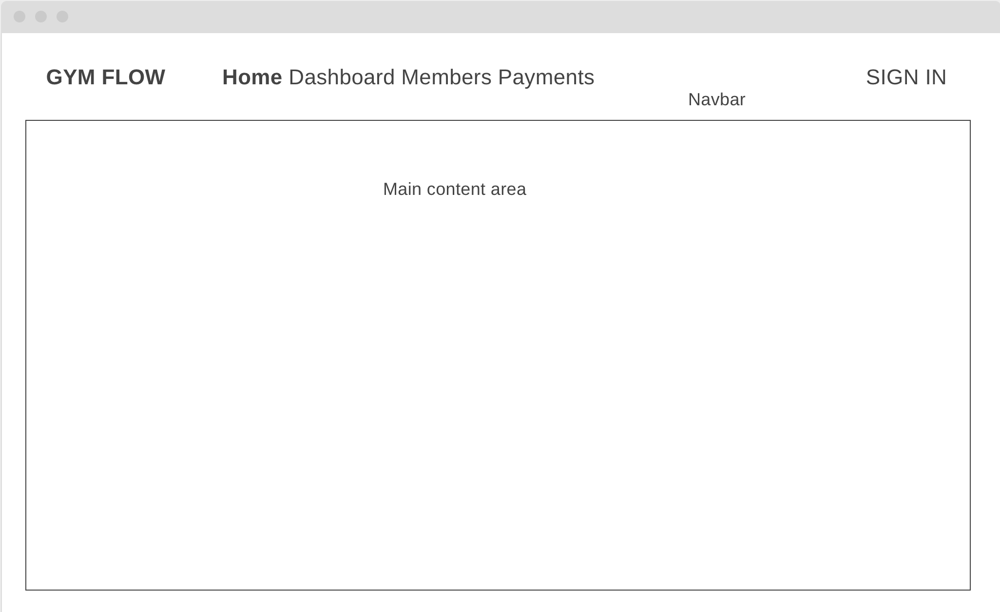
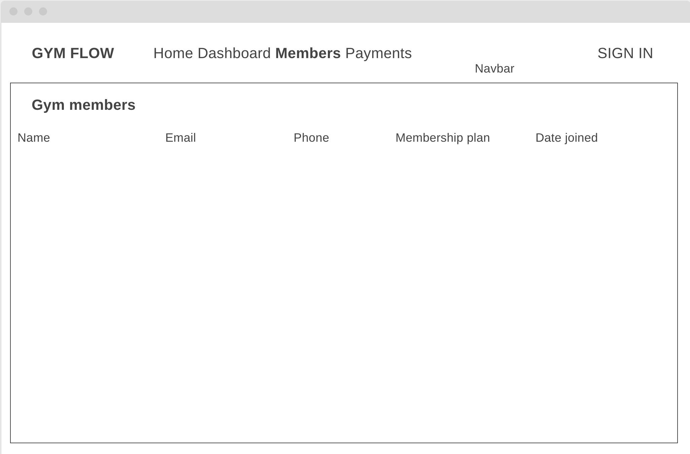
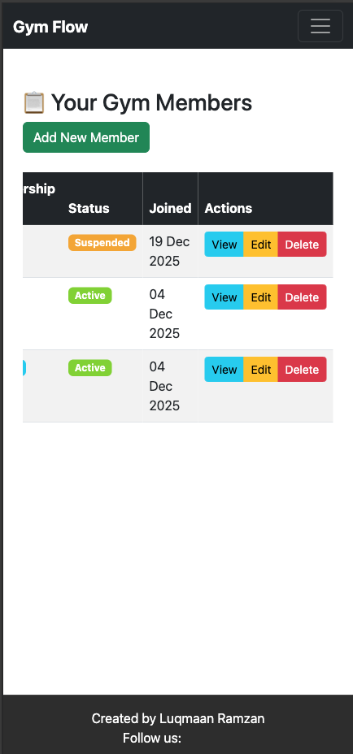
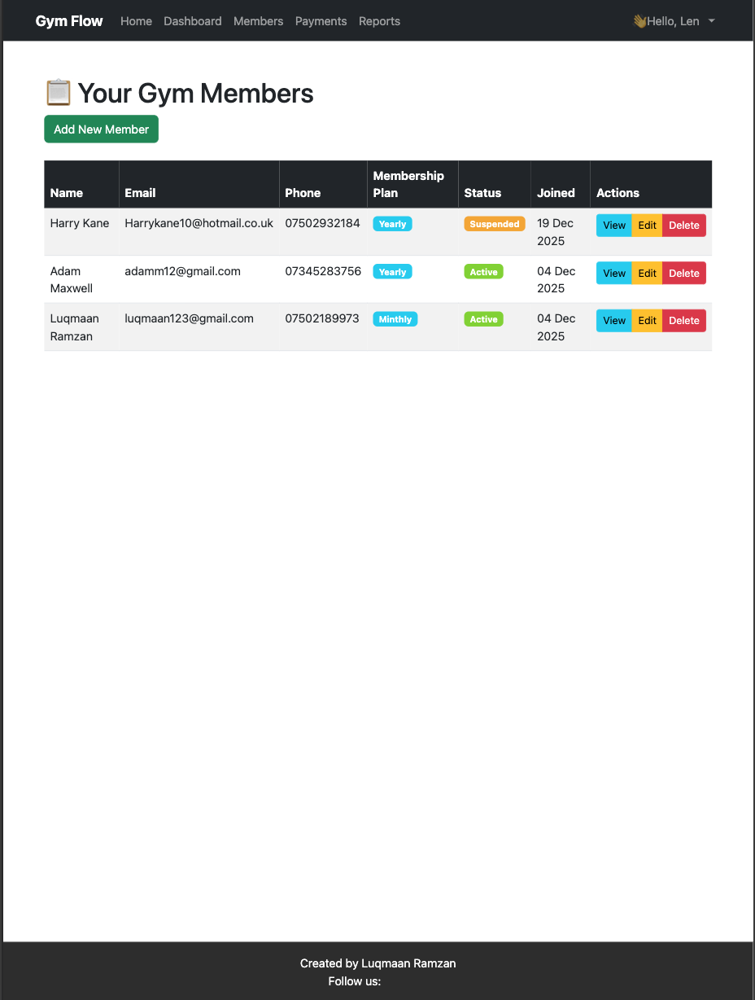
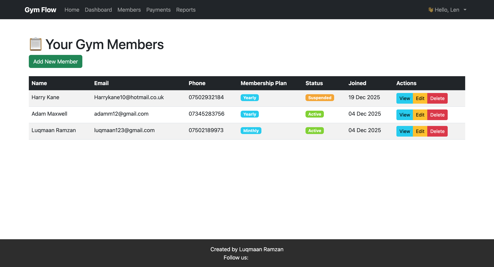
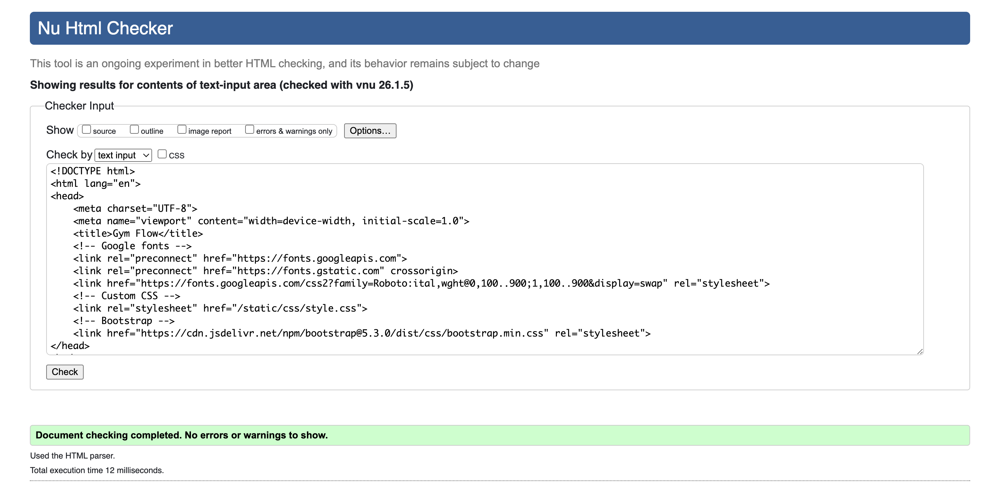
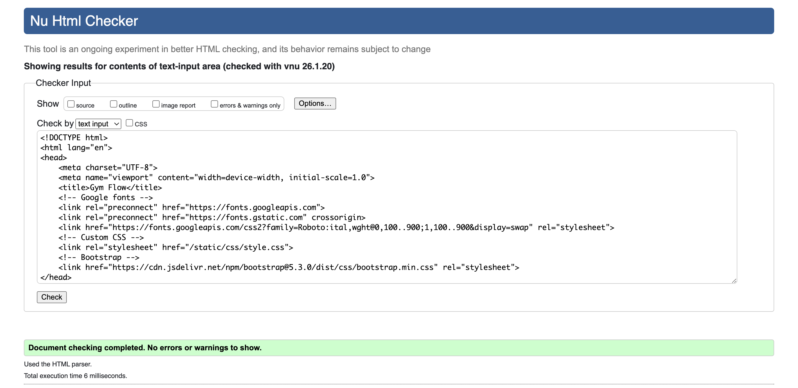
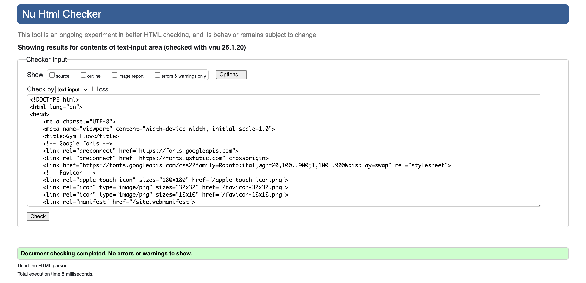
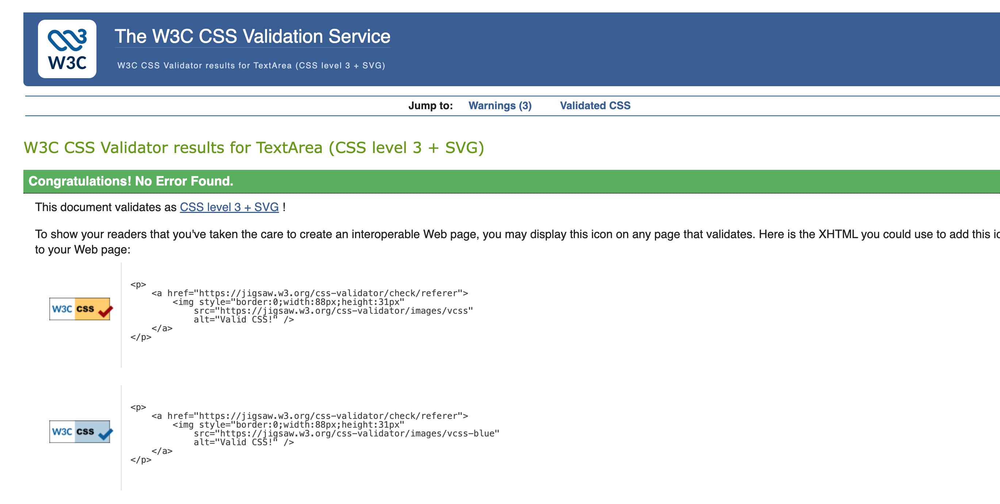
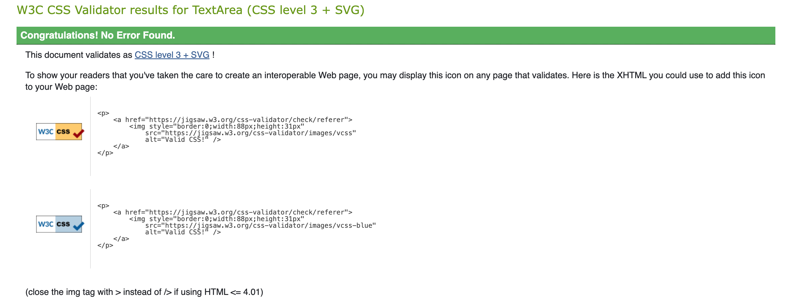

LINK TO LIVE SITE: https://gym-membership-system-28848c7c0952.herokuapp.com/

# Gym Membership Tracker

## About 
This application is intended to be used by owners and staff of gyms in order to keep up to date with their members and their memberships to those gyms as well as storing key contact information needed for communication or emergencies.

This is a gym management platform designed to provide a reliable backend architecture for handling essential gym operations such as membership tracking, payment records, and attendance logging. The focus of this project is on functionality, maintainability, and data structure, creating a scalable foundation that can be expanded with additional features in the future.

ONLY THE MEMBERS PART OF THE APP HAS BEEN IMPLEMENTED, OTHER APPS ARE IDEAS FOR THE FUTURE

---

## Features

### Implemented Features
- **Member Management**: Create, read, update and delete gym members
- **Membership Plans**: Create different membership tiers with pricing (In Django admin)
- **Authentication**: Gym owner login/logout with session management
- **Responsive Design**: Works on desktop, tablet, and mobile
- **CRUD Operations**: Full Create, Read, Update, Delete functionality

### Future Features
- Payment tracking and invoicing
- Attendance logging with check-in system
- Reports and analytics dashboard
- Inventory management for supplements

### Security Features
- All passwords and secret keys stored in environment variables (.env file added to .gitignore)
- DEBUG mode is set to False in production (Heroku config)
- User authentication restricts access to staff only

---
## Database Schema  

The application uses PostgreSQL with the following models:  

### Gym Model  
- `name`: Gym name
- `address`: Physical location
- `owner`: ForeignKey to User (one gym per owner)
- `phone_number`, `email`: Contact details
- `date_joined`: Auto-generated timestamp
- `is_active`: Active/Inactive

### Member Model  
- `membership_plan`: ForeignKey to MembershipPlan
- `first_name`, `last_name`: Member's name
- `email`, `phone_number`: Contact details
- `date_of_birth`: Date of birth
- `emergency_contact`: Emergency contact info
- `status`: Active/Inactive/Suspended/Frozen
- `date_joined`: Auto-generated timestamp

### MembershipPlan Model  
- `gym`: ForeignKey to Gym
- `plan_name`: Name of the plan (e.g., "Premium Monthly")
- `duration_months`: Duration in months
- `price`: Monthly/annual price
- `description`: Describes the benefits of the membership plan and its duration
- `status`: Active/Inactive

### Membership Model  
- `member`: ForeginKey to member
- `membership_plan`: Foreginkey to MembershipPlan
- `start_date`: Start of the membershio
- `end_date`: End of the membership
- `created_on`: Timestamp of when the membership was made
- `status`: Active/Inactive

## Data Schema Rationale  
The database was designed to reflect real-world gym management needs:
- **Gym ↔ Member (One-to-Many)**: One gym can have many members
- **Member ↔ Membership (One-to-Many)**: A member can have multiple membership records over time
- **MembershipPlan ↔ Membership (One-to-Many)**: A plan can be assigned to many members
- **Emergency contact fields** included for health & safety compliance
- **Status tracking** (Active, Frozen, Suspended) allows flexible member management

## UX Design

### User Stories 

As a Gym Owner, I want to add new members with their contact and emergency information so that I can grow my member base safely and maintain proper records.  

As a Gym Owner, I want to assign members to different membership plans with start and expiry dates so that I can manage different pricing tiers and automate renewals.  

As a Staff Member, I want to search for and view a member's full profile so that I can quickly access their contact details and emergency information when needed.  

As a Staff Member, I want to log a member's check-in so that I can track attendance and know who is currently in the gym.  

As a Staff Member, I want to record a payment against a member's account so that I can keep their membership active and track revenue.


### Entity Relationship Diagram (ERD)

The following diagram represents the database structure for the Gym Membership Tracker.  
It illustrates how the main entities — Member, MembershipPlan, Payment, and Attendance all relate to each other.
  
- Each **Member** belongs to one **MembershipPlan**.  
- Each **Member** can have multiple **Payments** records.
- Each **Member** can have multiple **Attendance** records.
- Each **MembershipPlan** has **Payments** records.


---
### Strategy  
The main users of this platform are the owners and staff of gyms. Users can view and manage gym members, update their membership details, and handle payment records. The system aims to reduce manual paperwork and make gym administration more efficient and data-driven.

This platform helps gym owners track key business information, such as member activity, payment status, and plan types all from one place.

Gym owners have reported experiencing the following issues with software they're currently using:

- Many customers still pay in cash, but their systems are designed only for card payments, resulting in separate handwritten records.

- Their systems lack flexibility for tracking temporary freezes or adjustments to memberships.

- Inventory tracking (e.g., for drinks or supplements) is inconsistent, with no easy way to monitor stock levels.

The main goal of this project is to help gym owners manage their businesses with greater efficiency and accuracy, providing a system that proactively assists with daily operations rather than reacting to problems.

---

### Scope
This system is a "back-office" management software designed specifically for gym owners and staff. The core purpose is to streamline daily operations and provide clear visibility of membership and payment data.

#### Core Membership & Operations

- Dashboard: Overview of key metrics (active members, today’s revenue, total memberships).  
- Member Management: Add, edit, and view member profiles including contact and emergency information.  
- Payment Records: Record and view payments, track amounts due, and identify overdue members.  
- Membership Plans: Assign members to plans (e.g., monthly, annual) with start and expiry dates.  
- Attendance Tracking: Log and monitor member check-ins.  

#### Business Insights

- Membership Statistics: Overview of how many members are active, inactive, or frozen.  
- Revenue Tracking: Breakdown of income from memberships and other payments.  

#### Future Developments

- Inventory Management: Track sales and stock of supplements or merchandise.  
- Referral System: Allow members to refer friends and earn rewards.  
- Guest Pass System: Manage guest entries and conversions to full members.  
- Predictive Insights: Identify at-risk members or forecast stock needs.  
- QR/Barcode Check-In: Optional feature for quick access at the front desk.  
---

### Structure
The following will show different user flows when using the system.  

1. Daily Member Check-In (Front Desk Staff)  

Goal: Get a member from the door to the gym floor in under 10 seconds.  
START: Staff member is on the main "Dashboard" screen.  
ACTION: Staff clicks the large "Check-In" button on the dashboard, or scans a member's key tag/card using a barcode scanner.  
SYSTEM RESPONSE: The system automatically opens the check-in window with the scanner input focused. If scan/search is successful: The member's profile picture, name, and membership status ("Active") instantly appear.
If membership is expired/frozen: A clear warning message appears (e.g., "Membership Paused - Please See Manager").

ACTION: Staff sees the green "Active" status and clicks the "Check In" button.

SYSTEM RESPONSE: A success message ("Welcome, John!") flashes on screen.
The system logs the check-in timestamp and closes the window.  
The dashboard's "Active Members Now" counter increments by one.

END: Staff is back on the dashboard, ready for the next member.  

---
2. Managing a "Soft" Membership Freeze (Gym Owner/Manager)  

Goal: Pause a loyal member's membership for a non-standard period without hassle.  
START: From the dashboard, the owner searches for and opens the member's profile (e.g., "Mike").  
ACTION: On Mike's profile page, the owner clicks the "Freeze Membership" button.  
SYSTEM RESPONSE: A simple modal/pop-up appears with two fields:  
Reason (Dropdown: Injury, Vacation, Off-Season, Other)  
Duration (Two options: Standard Policy OR Custom: [ ] Days)

ACTION: Owner selects "Off-Season" and types 21 in the "Custom Days" field.  
ACTION: Owner clicks "Apply Freeze".

SYSTEM RESPONSE: The system calculates the auto-resume date (e.g., "Will auto-resume on Nov 25"). Mike's status on his profile updates to "Frozen (Until Nov 25)". The system creates a calendar entry to auto-resume billing.  

END: Owner closes Mike's profile. The task is complete with no manual reminders needed.

---
3. Processing a Cash Payment & Logging a Supplement Sale (Front Desk Staff)

Goal: Log a financial transaction and update inventory in one seamless flow.  
START: Staff is in the member's profile page (e.g., "Sarah").  
ACTION: Staff clicks the "Take Payment" button.  
SYSTEM RESPONSE: The "Process Payment" screen opens, defaulting to Sarah's monthly membership fee.

ACTION: Staff changes Payment Method to "Cash". Staff clicks "Add Item" and selects "Pre-Workout (Scoop)" from the inventory list.

SYSTEM RESPONSE: The system adds the scoop to the transaction and shows a running total.  

ACTION: Staff clicks "Process Payment & Print Receipt".

SYSTEM RESPONSE: The system records the cash payment against Sarah's account. It decrements the "Pre-Workout" inventory by one serving.
It sends the receipt to the connected printer.  

END: Staff hands the receipt to Sarah. The dashboard's "Today's Revenue" updates.

### Skeleton

The image above shows the home page, a simplistic design of the web app that I am trying to go with 


The image above shows the page where members would be listed
---
### Surface

1. Design Philosophy & Mood
Keywords: Power, Clarity, Durability, Focus.

Inspiration: Industrial gym aesthetics—brushed metal, rubber mats, dark tones with bold accent colours. The interface should feel like a gym enivronment.

Goal: Reduce visual noise. Prioritise data and actions. Make the system enjoyable to use for long, stressful shifts.

---
2. Colour Palette
Primary Background: #1a1a1a (Near black). Reduces eye strain in low-light environments and makes content pop.  
Secondary Background/Cards: #2d2d2d (Dark grey). Used for card surfaces and modals.

Primary Accent: #f5a623 (Amber/Orange). A high-energy, warning colour used for primary buttons and key interactive elements. It feels strong, not playful.  
Secondary Accent: #4a90e2 (Cool Blue). Used for informational links, secondary actions, and positive financial data.

Status Colours:  
Success: #7ed321 (Green)  
Warning: #f5a623 (Amber)  
Error/Danger: #d0021b (Red)

Text:  
Primary Text: #ffffff (White)  
Secondary Text: #b3b3b3 (Light Grey)

---
3. Typography
Font Family: Inter or Roboto. Sans-serif, highly legible, and professional. No serifs, no decorative fonts.

Hierarchy:  
H1 (Page Title): 28px, Semi-Bold, White. e.g., "Dashboard"  
H2 (Section Headers): 20px, Semi-Bold, White. e.g., "At-Risk Members"

Body Text: 16px, Regular, White.  
Secondary Text / Labels: 14px, Regular, #b3b3b3.  
Button Text: 16px, Medium, White.

---
4. Imagery & Icons  

Icons: Heroicons or Feather Icons. Outline style for a clean, modern feel. Consistent stroke width.  
Member Photos: Circular thumbnails. If no photo is provided, a default silhouette icon is used against a gradient background.

---  

## Design Rationale & UX Justification
### Why This Design Works for Gym Staff
- Dark theme (#1a1a1a) reduces eye strain during long shifts
- Amber accent (#f5a623) draws attention to key actions like "Suspended" badge and warnings
- Clear visual hierarchy with consistent navigation across all pages
- Responsive design ensures usability on front-desk tablets and mobile devices  

---   

## Testing

Thorough testing was conducted during the development of this application and are detailed as follows:

### Authentication 

- Valid login redirects to dashboard
- Invalid login shows error message
- Logout functionality works correctly  

### **Test 1: Valid Login**
Steps:  
Navigate to `/members/login/`  
Enter valid username: admin  
Enter valid password: yourpassword  
Click "Login" button  

Expected Result:  
Redirect to dashboard (/members/dashboard/)  
Success message: "Welcome to your dashboard"  
Navbar shows "Hello, admin"  
Can access protected pages  

Actual result:  
Works as expected!  

### **Test 2: Invalid login**
Steps:  
Navigate to `/members/login/`  
Enter valid username: admin  
Enter wrong password: wrongpass  
Click "Sign in"  

Expected result:  
Stays on login page  
Error message: "Invalid username or password, Please try again."  
Form clears username and password fields  

Actual result:  
Works as expected!  

### **Test 3: Logout functionality**
Steps:  
Navigate to logout button, click  

Expected result:  
Logout of user  
Redirect to home page  

Actual result:  
Works as expected!

---

### Member Management

- Create new member with valid data
- Edit member information
- Delete member with confirmation
- View member details page

### **Test 1: Create New Member with Valid Data**  
Steps:  
Navigate to `/members/login/`  
Enter valid username: admin  
Enter valid password: yourpassword  
Click "Sign in"  
Navigate to `/members/members/add/`  
Fill form with:  
First Name: John  
Last Name: Doe  
Email: john.doe@example.com  
Phone: 07123456789  
Date of Birth: 1990-01-01  
Emergency Contact: Jane Doe  
Emergency Phone: 07987654321  
Status: Active  
Click "Create Member"

Expected result:  
Redirects to `/members/members/`
Success message: "Member John Doe created successfully!"
New member appears in member list with "Active" status badge

Actual result:  
Works as expected!

### **Test 2: Edit Member Information**
Steps:  
Navigate to `/members/login/`  
Login with valid credentials  
Navigate to `/members/members/` 
Click "Edit" on any member  
Change First Name to `Harry`  
Change Status to `Suspended`  
Click "Update Member"

Expected result:  
Redirects to `/members/members/`  
Success message: "Member [Name] updated successfully!"  
Member shows updated name in list  
Status badge changes from green to orange

Actual result:  
Works as expected!

### **Test 3: Delete Member with Confirmation**
Steps:  
Navigate to `/members/login/`  
Login with valid credentials  
Navigate to `/members/members/`  
Click "Delete" on a test member  
On confirmation page, click "Delete Member"

Expected result:  
If confirmed: Redirects to member list, success message, member removed  
If canceled: Returns to member list, no changes  
Member no longer appears in list  


### **Test 4: View Member Details Page**
Steps:  
Navigate to `/members/login/`  
Login with valid credentials  
Navigate to `/members/members/`
Click "View" on any member

Expected result:  
Member details page loads completely  
Shows all information: contact, emergency, membership plan  
Edit and Delete buttons available  
Status displayed clearly with colored badge

Actual result:
Works as expected!

---  

### Form validation

- Required fields enforced
- Email format validation
- Phone number acceptance  

### **Test 1: Create Member - Missing Required Field**
Steps:  
Navigate to `/members/login/`  
Login with valid credentials  
Navigate to `/members/members/add/`  
Leave "First Name" field empty  
Fill all other required fields  
Click "Create Member"  

Expected result:  
Stays on form page  
Error message under First Name: "This field is required"  
Form preserves other entered data  

Actual result:  
Works as expected!

### **Test 2:  - Missing Required Fieldn**  
Steps:  
Navigate to `/members/login/`  
Login with valid credentials  
Navigate to `/members/members/add/`  
Enter "not-an-email" in Email field  
Fill all other required fields  
Click "Create Member"  

Expected result:  
Stays on form page  
Error message under Email: "Enter a valid email address"  
Form preserves other entered data  

Actual result:  
Works as expected!

### **Test 3: Phone Number Acceptance**
Steps:
Navigate to `/members/login/`  
Login with valid credentials
Navigate to `/members/members/add/`  
Enter "07123456789" in Phone field  
Fill all other required fields  
Click "Create Member"  

Expected result:  
Redirects to member list  
Member created with phone: "07123456789"  
No validation errors for phone format  

Actual result:  
Works as expected!  

---  

### User Experience 

- Responsive design on mobile/tablet/desktop
- Clear success/error messages

### **Test 1: Responsive Design - Mobile View**

Steps:
Open Chrome DevTools (F12 or right click on mac and click insepct)  
Click "Toggle Device Toolbar" (📱 icon)  
Select "iPhone 14 Pro" (390x844)  
Navigate to `/members/members/`  
Navigate to `/members/members/add/`  
Navigate to `/members/dashboard/`  

Expected result:
No horizontal scrolling needed (except for when necessary for table view of members)  
Navbar collapses to hamburger menu  
Text readable without zooming  

Actual result:   
Works as expected!

### **Test 2: Responsive Design - Tablet View (iPad)**  

Steps:  
Open Chrome DevTools (F12 or right click on mac and click insepct)  
Click "Toggle Device Toolbar" (📱 icon)  
Select "iPad Air" (1024x1366)  
Navigate to `/members/members/`  
Navigate to `/members/members/add/`  
Check member list table layout  

Layout adapts to medium screen width
Forms use appropriate column layouts
No horizontal scroll

Actual result:   
Works as expected!  

### **Test 3: Responsive Design - Desktop View**
 
Steps:  
Close DevTools (normal browser view)  
Navigate to all major pages  
Resize browser window gradually from full screen to narrow  

Expected result:  
Layout adapts smoothly at all sizes  
No content overlaps or breaks  
Navigation remains accessible  
Consistent experience across breakpoints  

Actual result:  
Works as expected!  

---  

## Code validation

### HTML
- All HTML was validated using the [W3C Markup Validator](https://validator.w3.org/).  
- **Initial Issue**: Django template tags (``) appeared before `<!DOCTYPE html>`.  
- **Fix**: Right click on webpage, click View Page Source, copy and paste rendered HTML.  
- **Result**: All HTML code free of errors.  

Below is the validation for the home page HTML.  
  

Below is the validation for the login page HTML.  
  

Below is the validation for the members page HTML.  
  


### CSS
- Custom CSS validated via [W3C CSS Validator (Jigsaw)](https://jigsaw.w3.org/css-validator/)  
- **No errors found** in custom stylesheets.  
- **Note**: Bootstrap CSS files were excluded from validation as they are third-party.

Below is the CSS validation for the home page.  
  

Below is the CSS validation for the login page.  
  

## Deployment and setup

### Local development setup

1. **Clone the repository**  
In your terminal:  

```bash
git clone https://github.com/Luqmaan-io/gym-membership-tracker.git
cd gym-membership-tracker
```  

2. **Create virtual environment**

In your terminal:

```bash
python -m venv venv
source venv/bin/activate  # On Windows: venv\Scripts\activate
```  

3. **Install dependencies**

In your terminal:

```bash
pip install -r requirements.txt
```  

4. **Setup environment variables**

In your terminal:

```bash
cp .env.example .env  # Create your own .env file
# Edit .env with your settings:
# DJANGO_SECRET_KEY=your-secret-key-here
# DJANGO_DEBUG=True
# DATABASE_URL=sqlite:///db.sqlite3
```  

5. **Run migrations**

In your terminal:

```bash
python manage.py migrate
```  

6. **Create superuser**

In your terminal:

```bash
python manage.py createsuperuser
```  

7. **Run development server**

```bash
python manage.py runserver
```  

### Herkou deployment

1. **Install Heroku CLI** and login

```bash
heroku login
```  

2. **Create Heroku app**

```bash
heroku create your-app-name
heroku addons:create heroku-postgresql:hobby-dev
```  

3. **Set environment variables**

```bash
heroku config:set DJANGO_SECRET_KEY=your-generated-secret-key
heroku config:set DJANGO_DEBUG=False
heroku config:set DISABLE_COLLECTSTATIC=1
```

4. **Deploy to Heroku**

```bash
git push heroku main
heroku run python manage.py migrate
heroku run python manage.py createsuperuser
heroku open
```  

---

## Technologies used  
HTML5 – structure  
CSS3 – styling & animations    
Python - Constructing database  
Django - Open-source framework used for backend  
VS Code - This web app was developed using VS code, a code editor developed by Microsoft. https://code.visualstudio.com/  
Google Fonts - Used to add custom typography to the site. https://fonts.google.com/  
Favicon.io - Used to generate the sites favicon in multiple formats. https://favicon.io/  
ChatGPT - Used to help debug and guide with unfamiliar css and javascript skills. https://www.chatgpt.com  

---  

## Credits

Len Johnson for fantastic support during the early development of this project.  
ChatGPT for brainstorming on ideas and problem solving.  